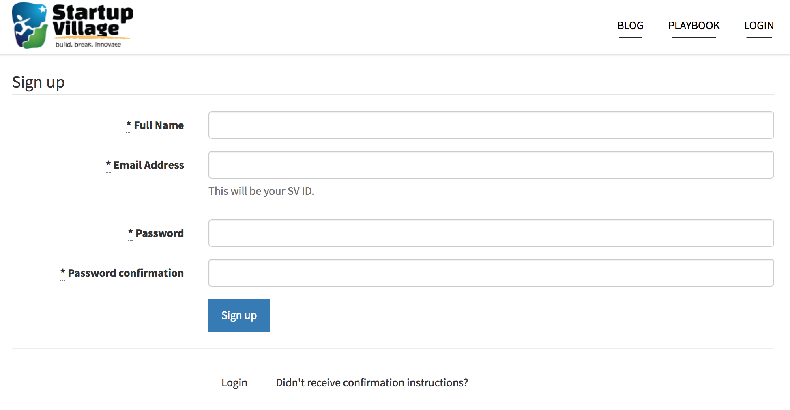
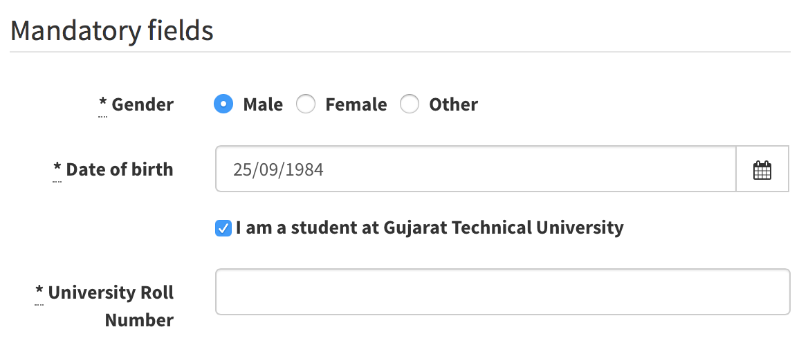
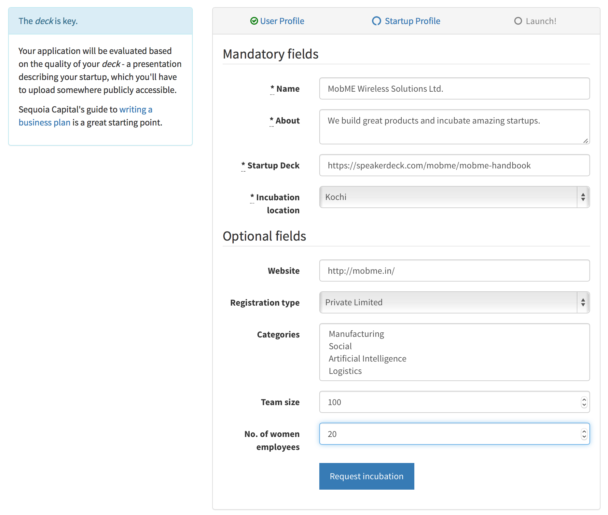



# The Startup Village Application

## Eligibility

Any founding team can apply to join Startup Village. We don't have specific criteria in terms of the business sectors we accept or the type of products (hardware or software) you build. But **we're structured to best help first time founders**. If you are a founder in college or right out of college, or you are thinking of starting up but don't know how to, you are welcome to join.[^1]

## Applying

The Startup Village application is entirely online. Some important notes before you start:

* Every founder needs to have an SV.CO ID.
* Only one founder (the team leader) should start and complete the Application.
* This founder can add co-founders by their SV.CO IDs after the application has been submitted.
* In case your team accidentally creates multiple applications, duplicate applications can be deleted by clicking the Cancel Application button (before Application submission) & Delete Startup button in your Startup Timeline (after Application Submission)

### Creating SV.CO IDs for All Founders

Founders should start by going to [SV.CO](https://sv.co) and creating an SV.CO ID (the Join SV.CO link).

An SV.CO ID is an account associated with your email address that is used for all things Startup Village.

**Note:** if you had an SV ID before August 5 2015, you'll have to create a [fresh new SV.CO ID](https://sv.co/). Old IDs created through the legacy Startup Village website will not work.

*Note*: if you don't have an idea or a team yet, you are in the Idea Discovery stage, and you can't apply to Startup Village yet. But don't fret: read our notes on the [Idea Discovery stage](stages/5.1-idea-discovery.md) to proceed.

### Application by Team Leader

Once the team leader creates an SV.CO ID, clicking "Start Application" on the home page will start the SV.CO Application Process.

During the process, you submit your idea, add your team members, and submit [your initial idea slides](stages/5.1.1-deck.md)[^2]. Once your slides are evaluated and accepted, you are in!

In the first section, you fill in your basic information. It's best to fill in as much of the optional fields as you can.

If you are a student of [an University that we have partnered with](1-partnership.md), **make sure you fill in your University Roll Number**:

---
Next you create your basic Startup Profile. The most important item here is your deck. To get pointers on how to create a good deck, see the [Idea Discovery](stages/5.1-idea-discovery.md) page.

### Adding Co-Founders by Team Leader
And that's it! You can then add in co-founders here. *Note:* Currently, it's compulsory for you to have at least one cofounder for a successful application[^3].

## Application Evaluation
We evaluate your application based on your product idea and business model as you've demonstrated in your product slides. The [Idea Discovery stage](stages/5.1-idea-discovery.md) and in particular, the [Deck writeup](stages/5.1.1-deck.md) has more resources on how to prepare a great slide deck.

If your application is rejected, you'll receive an email with pointers on how to re-apply. These are the most common reasons for rejection:

* The Deck deviates widely from the format specified in [Deck](stages/5.1.1-deck.md).
* Your Deck has too much text.
* You've described too many Product Ideas. As described in the [Idea Discovery](stages/5.1-idea-discovery.md) section, focus is important.
* Your Product idea is unclear and cannot be understood. Ideally, you should demonstrate your product workflow using easily understood diagrams. See the [example Deck provided here](stages/5.1.1-deck.md).
* You haven't studied your competitors well.
* There is no clear business model described.

**Note:** If you are rejected, we will not be able to provide personal mentoring to help you create better slides. Because of the almost entirely online and self-learning nature of the SV.CO program, we'll reserve our office hours to startups who are able to demonstrate learning.

You can always try again though. Just update your slides & ping your SV.CO representative on Slack or email help@sv.co. We'll review again!

*Pro tip*: If you send us a link to an early prototype of your idea, your chances of getting in go up dramatically. As you'll learn, our evaluation processes emphasize what *you can do* with your skills. 

## Acceptance
If you are accepted, the next step is to sign a [formal legal agreement with Startup Village](2-legal-agreement.md). 

---
[^1]: This doesn't mean we discriminate against experienced founders. On the contrary, you'll probably get accepted faster and move through stages quicker. If you think we can add value, we'll be happy to help!
[^2]: Use sites such as [SlideShare](http://www.slideshare.net), [SpeakerDeck](https://speakerdeck.com) or [Google Slides](http://www.google.com/slides/about/) to share your product deck.
[^3]: This is because we believe a team of at least three, and preferably four founders work best. Read up on [roles](5-startup-roles.md) to learn more about what it takes to build a startup team.