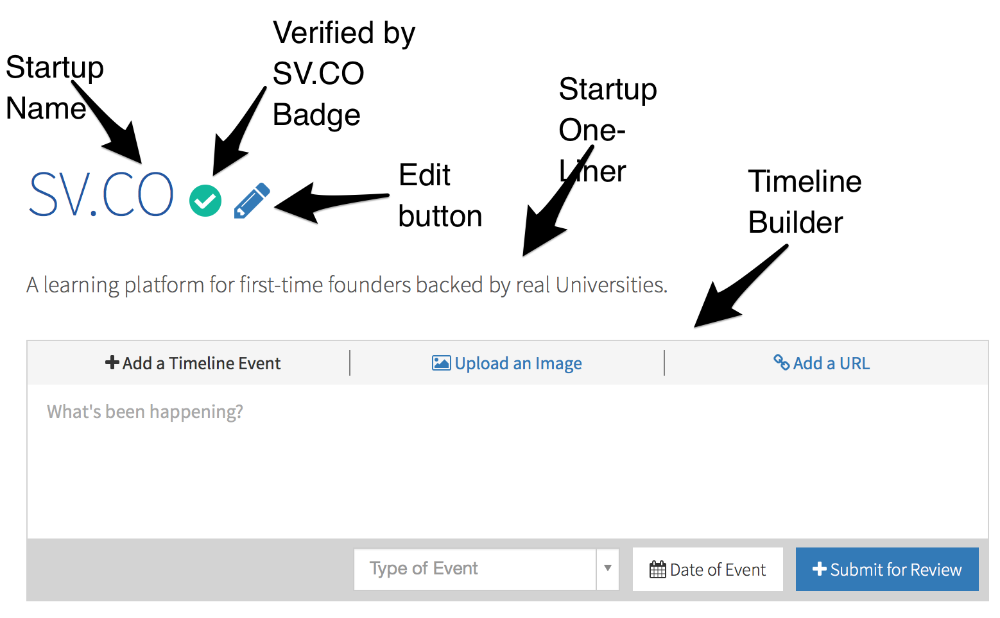
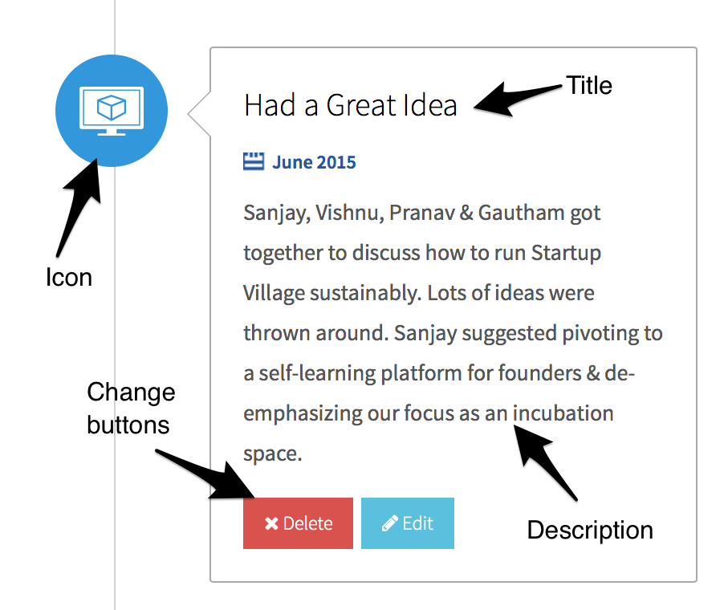
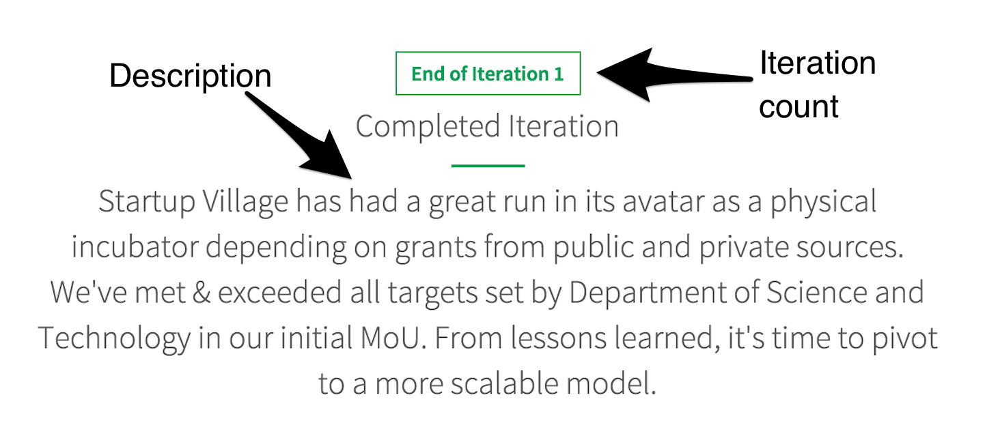
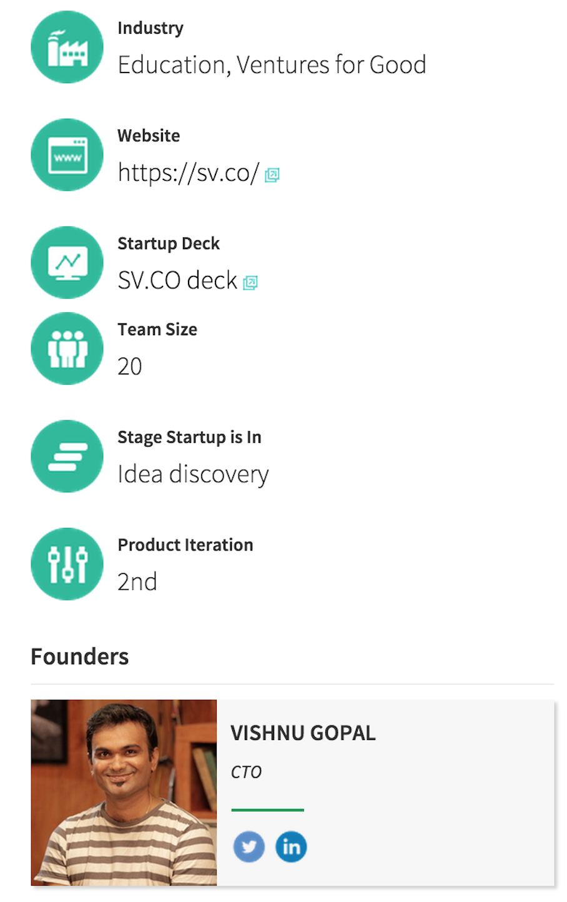
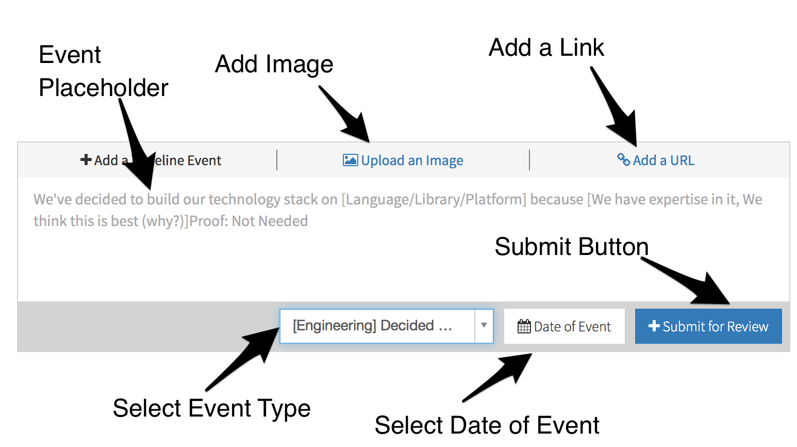
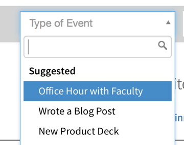



# Verified Timelines

The Verified Timeline is your **showcase** to mentors, investors, and potential companies who are looking to acquire your team or your startup. It can even act as a transcript[^1] when you apply for higher education. So needless to say, they are a **crucial part of the SV.CO program**, and it's important that you learn more about it.

The Verified Startup Timeline is modeled on a Facebook Profile Timeline, but there are three important differences:
  
* You submit *events* important to your Startup, not *posts*.
  
  Events are important milestones in your startup journey. To help you with picking events, we have collected a few common *Event Types*.
* All events in the Verified Startup Timeline are public.

  This is because SV.CO is a self-learning platform, and one of the most important ways founders learn is by sharing information through their Timelines, and viewing those of other startups before them. 
* All events **will be verified by SV.CO** before they are added.

  We want the Timeline to be an authentic representation of your startup journey so you can send your Timeline to potential investors or mentors and they can trust the information presented there.
   
## Timelines in Brief

Let's take you through a visual tour of a verified timeline.

The top bit of your timeline has your *Startup Name*, a *Verified by SV.CO badge*, and a *Startup One-Liner*.

We recommend that your *Startup Name* be the same as the name of your initial Product[^2]. Teams that are approved automatically get the *Verified by SV.CO badge*. Make your *Startup One-Liner* an easy to understand description of your product.

Startup Founders see the *Edit Button* and the *Timeline Builder* when they are logged in. We'll talk about this later down this page.

**Timeline Events** are notable milestones in your startup journey. There could many different *Event Types*, as an example: a team member joining, a fundraising event, legally incorporating your startup, developing a new prototype, et. al. All timeline events are verified by Startup Village.

The *Title* of the event is automatically set based on the *Event Type*, and is not customisable. The *Description* is a focused 300 character writeup of your event. You tap on *Change Buttons* to delete or edit an event. Each edit will require verification from SV.CO.

Note that Timeline Events can also have pictures in them, and it's strongly recommended that you add one when it's relevant!

**Iterations** are different versions of your product. You may perhaps start with one idea and decide that a part of it is not working as intended, and then launch an improved version to test. **Pivots** happen when you launch a new product because your old one wasn't achieving traction or growth. **Iterations and Pivots are common**, and often a useful tool to focus your team on a different idea.

*Iteration Count* tracks how many iterations and pivots a startup has made. Note: many mentors and investors prefer a *higher iteration count*, not a lower one because they like to interact with more mature startups.

Your Startup Timeline also has more *snapshot information* available. If you are viewing your timeline on a desktop, this information is displayed in a sidebar. On a mobile, they are available at the top of your timeline.

Most of this should be self-explanatory, except for: *Stage Startup is In*. Stages are different parts of your startup journey. At SV.CO [we support startups through five stages](5-startup-stages.md). Note that when you pivot or start a new iteration you might go back a stage. This is perfectly OK! As an example, a team can develop an idea until the Scaling stage and decide that while they have some customers, the product is too hard to scale. They can then go back to the drawing board, refine the idea based on their learnings & new skills and build a new product entirely. In fact, this is encouraged. 

**Your goal**: to find an idea and take it through the five startup stages.

## The Timeline Builder

This is meant to be a friendly way to update your timeline. A lot of this would be self-explanatory, except perhaps for *Event Type*: this is how we categorize events. Event Types are segmented by [Roles](4-startup-roles.md): *Improved Scalability* (which is an Engineering event), *Co-founder Joined* (a Governance event), *Refined UX* (a Design event), or *Attended an Event* (a Marketing & Sales event).

You also have Suggested Events, which can serve as a helpful guide to what activities to do next:

## Tip 1: Keep your Timelines Updated

This is the single most important piece of advice you'll receive as part of the SV.CO program: make sure your timeline data is in sync with your startup.

There are several reasons that entrepreneurs usually think up *not to* update their timelines. **All of these are the *wrong* reasons**:

1. Your current idea is not getting traction and you are looking for that one big break before you update your timeline.

   One of the indicators that we rank startups in internally is velocity, or how fast they move within and between stages. One of the best correlations that we've found for successful startups is to find folks who always communicate: in good times and bad. It doesn't matter if your product is not achieving customer validation. Perhaps you have added a business partner to help you explore more options? Or you've pivoted to a different sector? Communicate through your timelines. It's very important that you do. **We recommend you update your timelines every week**.

2. There's nothing happening that is important enough to update.

   While there are lulls in any startup, a continuous period of inactivity is a danger signal. Perhaps you need to rethink your approach? Good startups are continuously in motion, building enough momentum to move from one stage to the next. If you are not moving, you don't generate momentum.

3. Some of my founders left and I'm struggling to make ends meet.

   Adversity affects every startup. Again, please see point 1. Communicate in good times and bad. 
   
   Also please note that we have six avenues to graduate. Please talk to your SV.CO representative and figure out more options.
   
In fact if there's one good reason to not update your timelines it's that there's something exciting happening to you that you'd like to update but it's something that we don't currently verify. Startups continuously do new things. There might be a new event in your journey that is important but we may not have that as an *Event Type*. You can always use the *Update* event to pencil that in, and if it occurs commonly enough, we'll add that as a proper *Event Type*.

# Tip 2: Make Quality Timelines

Your timeline is like your startup resume. Just like you wouldn't put junk in your resume, your timelines should be pristine and beautiful too. This means uploading high-quality logos, making sure your founder profile pictures are perfect, and most importantly, that your timeline updates make sense!

Here are some examples of **BAD** timeline updates:

1. *"Pivoted to new product"*: This is bad because it hardly has any information at all for an interested viewer. A better one would be "Our previous iteration didn't have customer uptake because of XX. During interviews, we figured out that most customers wanted a different product that did YY. So we've pivoted."
2. *"I raised $$$! Yay!"*: Again be specific, but more importantly, be professional as well. Think of your SV.CO timeline just like you would your LinkedIn profile. This is not your Facebook Wall.
3. *"We is raising twelve thousand rupees as ANGEL Funding from our friendz"*: Please proofread and check for grammatical errors and typos.

While your SV.CO representative will help you with building timelines, ultimately it's up to you to own your timeline and make it great. Remember: this is what potential investors, mentors and employees will see.

## Next Steps

That's the quick overview of our most important features: Verified Timelines. Currently, you update your timelines by notifying your SV.CO representative about major timeline events, but we have an exciting timeline editor in the works.

This concludes Part 1 of our playbook. Next, we talk about [Startup Roles](4-startup-roles.md).

---
[^1]: Our [University Partnership](1-partnership.md) issues transcripts based on your Timeline.
[^2]: This is an at times controversial recommendation, but our reasoning is simple: You have only one brand to promote, and that makes marketing a lot simpler.
